## Joshua Mundt
## 03/14/2020
## Project 4

## Project Statement 

### Part 1) Wind and Rain Noise

1. In each site and for each category that you identified in step 3, plot 𝑃𝑆𝐷𝑑𝐵 vs frequency.

2. Compare the spectral levels and answer these questions: 

a) What is the effect of wind and rain on underwater noise? Explain any behavior you observe in your result. 

b) Which one has the highest impact? Rain or wind? 

c) What are the main reasons for observing different spectral levels in Oregon shelf compared to Oregon offshore? 

### Part 2) Airgun, Marine Mammals, Earthquake Noise

1.	Find a short time period that there is a marine mammal vocalization in recorded data and plot its spectrogram

2.	Find a short time period that there is an airgun noise in recorded data and plot its spectrogram

3.	Find a short time period that there is an earthquake or a volcano eruption in recorded data and plot its spectrogram.

4.	Compare the bandwidth of these three signals. Are they consistent with what is shown in the Wenz curve (refer to the Ocean Noise slides)?

### Introduction

### Part 1 solutions ) Wind and Rain Noise

1. In each site and for each category that you identified in step 3, plot 𝑃𝑆𝐷𝑑𝐵 vs frequency.

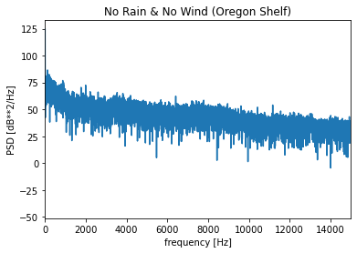

      Figure 1: 𝑃𝑆𝐷𝑑𝐵 vs frequency at Oregon Shelf in July 06, 2019
      
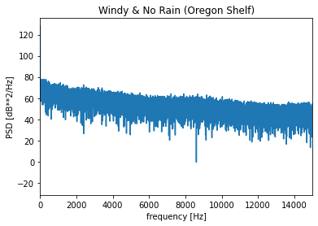

      Figure 2: 𝑃𝑆𝐷𝑑𝐵 vs frequency at Oregon Shelf in April 06, 2019

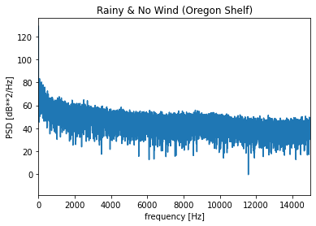

      Figure 3:𝑃𝑆𝐷𝑑𝐵 vs frequency at Oregon Shelf in March 06, 2019

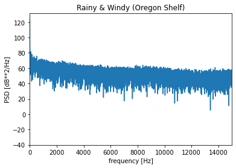

      Figure 4:𝑃𝑆𝐷𝑑𝐵 vs frequency at Oregon Shelf in March 01, 2019

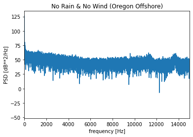

      Figure 5:𝑃𝑆𝐷𝑑𝐵 vs frequency at Oregon Offshore in Nov 16, 2018

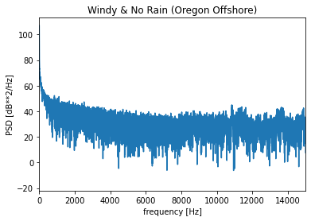
      
      Figure 6:𝑃𝑆𝐷𝑑𝐵 vs frequency at Oregon Offshore in Feb 27, 2019

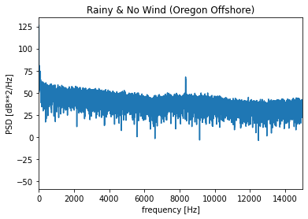
      
      Figure 7:𝑃𝑆𝐷𝑑𝐵 vs frequency at Oregon Offshore in Sep 01, 2018

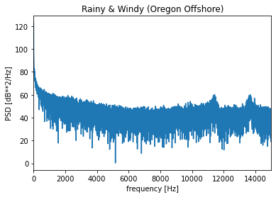
      
      Figure 8:𝑃𝑆𝐷𝑑𝐵 vs frequency at Oregon Offshore in Feb 10, 2019
      
2. Compare the spectral levels and answer these questions: 

a) What is the effect of wind and rain on underwater noise? Explain any behavior you observe in your result. 

b) Which one has the highest impact? Rain or wind? 

c) What are the main reasons for observing different spectral levels in Oregon shelf compared to Oregon offshore? 

### Part 2 solutions ) Airgun, Marine Mammals, Earthquake Noise

1.	A short time period that there is a marine mammal vocalization in recorded data and plot its spectrogram

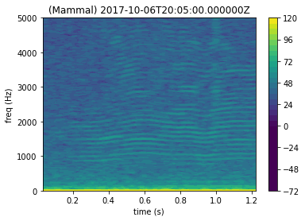

      Figure 9: Spectrogram of Marine mammal at Oregon Slope Base in Oct 06, 2017

2.	A short time period that there is an airgun noise in recorded data and plot its spectrogram

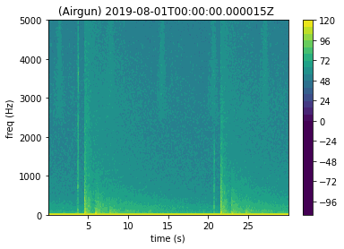

      Figure 10: Spectrogram of Airgun at Axial Base Seafloor in Aug 01, 2019

3.	A short time period that there is an earthquake or a volcano eruption in recorded data and plot its spectrogram.

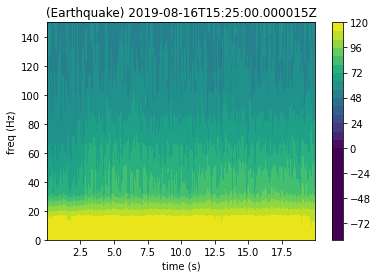

      Figure 11: Spectrogram of Earthquake at Axial Seamount in Aug 16, 2019

4.	Compare the bandwidth of these three signals. Are they consistent with what is shown in the Wenz curve (refer to the Ocean Noise slides)?

### Conclusion

### References

[1] https://dosits.org/science/sounds-in-the-sea/what-are-common-underwater-sounds/

[2]

[3]

[4] 
