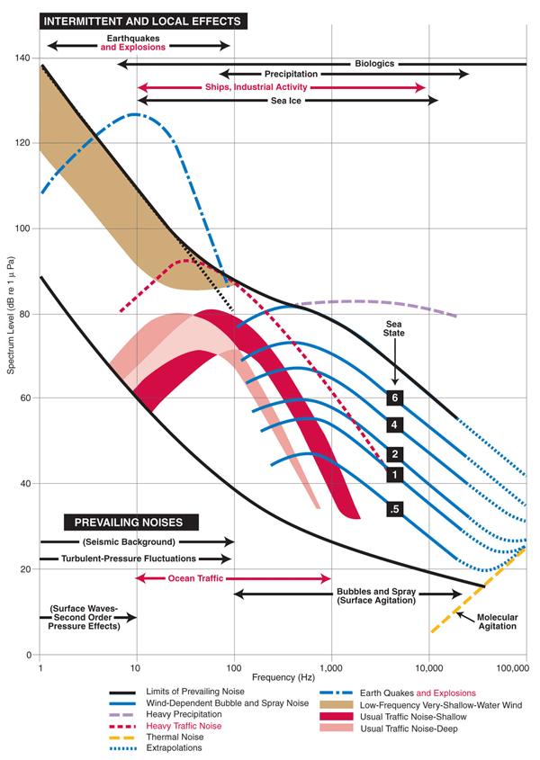

### Joshua Mundt
### 03/14/2020
### Project 4

## Introduction
This project asks students to obtain raw data from OOI broadband hydrophone website for Oregon Shelf and Oregon Offshore. Then, plot power spectral density in (dB) with respect to frequency for the following four different cases: when it doesn’t ran and it is not windy, when it does not rain and it is windy, when it rains and it is not windy, and when it rains and it is windy. Afterwards, make analysis on how wind and rain affect the spectral level. The next objective is to plot spectrogram for airgun, marine mammals, and earthquake noise from the same website. Then compare those three signal with Wenz Curve, and draw a conclusion on whether they are consistent with the bandwidth on the Wenz Curve. 

### Project Statement 

### Part 1) Wind and Rain Noise

1. In each site and for each category that you identified in step 3, plot 𝑃𝑆𝐷𝑑𝐵 vs frequency.

2. Compare the spectral levels and answer these questions: 

a) What is the effect of wind and rain on underwater noise? Explain any behavior you observe in your result. 
In the Oregon Shelf site, it is evident that the spectral level is higher in figure 4, when there is rain and wind at lower and higher frequency compare to figure 1, during the period of no wind and no rain or during the period of only rain or only wind, as show in figure 3 and 2.

b) Which one has the highest impact? Rain or wind? 
The rain has the highest impact when looking at both Oregon Offshore and Oregon Shelf sites. The power spectral density level starts from bout 80, as shown in figure 6 and the 𝑃𝑆𝐷𝑑𝐵 decreases at a faster rate as the frequency increases, whereas during the period where there is only rain, as show in figure 7, the initial power spectral density level is similar at lower frequency but when the frequency increase, it doesn’t decrease as fast

c) What are the main reasons for observing different spectral levels in Oregon shelf compared to Oregon offshore? 
attenuation loss

### Part 2) Airgun, Marine Mammals, Earthquake Noise

1.	Find a short time period that there is a marine mammal vocalization in recorded data and plot its spectrogram

2.	Find a short time period that there is an airgun noise in recorded data and plot its spectrogram

3.	Find a short time period that there is an earthquake or a volcano eruption in recorded data and plot its spectrogram.

4.	Compare the bandwidth of these three signals. Are they consistent with what is shown in the Wenz curve (refer to the Ocean Noise slides)?

### Part 1 solutions ) Wind and Rain Noise

1. In each site and for each category that you identified in step 3, plot 𝑃𝑆𝐷𝑑𝐵 vs frequency.

      Figure 1: 𝑃𝑆𝐷𝑑𝐵 vs frequency at Oregon Shelf in July 06, 2019
      

      Figure 2: 𝑃𝑆𝐷𝑑𝐵 vs frequency at Oregon Shelf in April 06, 2019

      Figure 3:𝑃𝑆𝐷𝑑𝐵 vs frequency at Oregon Shelf in March 06, 2019

      Figure 4:𝑃𝑆𝐷𝑑𝐵 vs frequency at Oregon Shelf in March 01, 2019

      Figure 5:𝑃𝑆𝐷𝑑𝐵 vs frequency at Oregon Offshore in Nov 16, 2018

      
      Figure 6:𝑃𝑆𝐷𝑑𝐵 vs frequency at Oregon Offshore in Feb 27, 2019

      
      Figure 7:𝑃𝑆𝐷𝑑𝐵 vs frequency at Oregon Offshore in Sep 01, 2018

      
      Figure 8:𝑃𝑆𝐷𝑑𝐵 vs frequency at Oregon Offshore in Feb 10, 2019
      
2. Compare the spectral levels and answer these questions: 

a) What is the effect of wind and rain on underwater noise? Explain any behavior you observe in your result. 

b) Which one has the highest impact? Rain or wind? 

c) What are the main reasons for observing different spectral levels in Oregon shelf compared to Oregon offshore? 

### Part 2 solutions ) Airgun, Marine Mammals, Earthquake Noise

1.	A short time period that there is a marine mammal vocalization in recorded data and plot its spectrogram

      Figure 9: Spectrogram of Marine mammal at Oregon Slope Base in Oct 06, 2017

2.	A short time period that there is an airgun noise in recorded data and plot its spectrogram

      Figure 10: Spectrogram of Airgun at Axial Base Seafloor in Aug 01, 2019

3.	A short time period that there is an earthquake or a volcano eruption in recorded data and plot its spectrogram.

      Figure 11: Spectrogram of Earthquake at Axial Seamount in Aug 16, 2019
      

      Figure 12: Wenz Curve [1]

4.	Compare the bandwidth of these three signals. Are they consistent with what is shown in the Wenz curve (refer to the Ocean Noise slides)?

## Conclusion

## References

[1] https://dosits.org/science/sounds-in-the-sea/what-are-common-underwater-sounds/

[2]

[3]

[4] 
